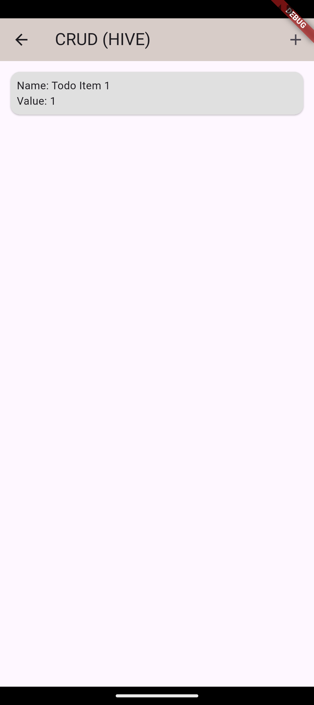
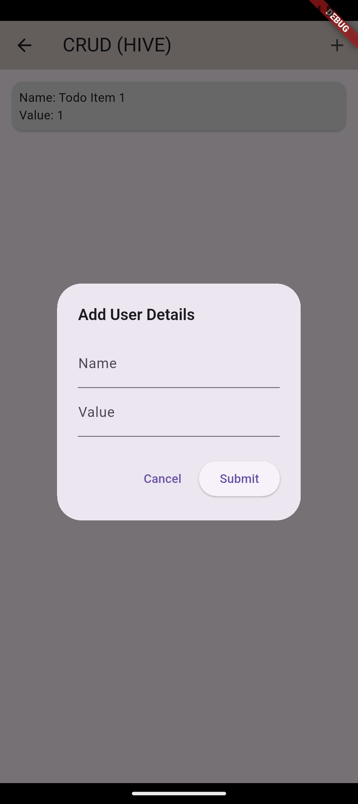
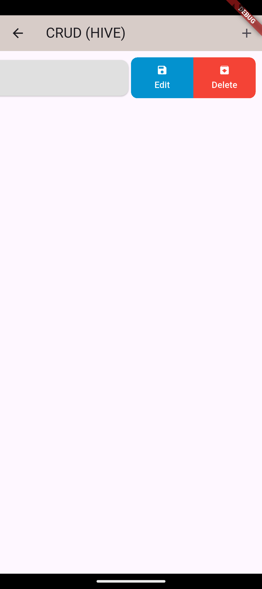

# 📝 Flutter Todo App with Local Database

A Flutter application demonstrating offline storage techniques using both **Hive (NoSQL)** and **Drift (SQL)** databases. The app includes full **CRUD operations** and is designed to showcase how to manage persistent local data in Flutter.

---

## 🚀 Getting Started

Follow the steps below to set up and run the project locally:

```bash
flutter clean
flutter pub get
flutter packages pub run build_runner build

```

## 📸 Screenshots

CRUD with HIVE and Drift

### Dashboard Screen


---

### Hive CRUD Operations

<table>
  <tr>
    <td></td>
    <td></td>
    <td></td>
  </tr>
</table>

---

### Drift CRUD Operations

<table>
  <tr>
    <td></td>
    <td></td>
  </tr>
</table>


